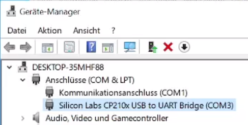
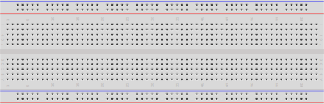

## ESP32

Der ESP32 ist ein günstiger (~10€) Microcontroller mit integriertem Wifi und BLE. Das hat ihn zu einem im Hobby und IoT Bereich weit verbreiteten Microcontroller gemacht.

Den ESP32 gibt es in verschiedenen Ausführungen. Für diesen Kurs verwenden wir ein ESP32 DevBoard Kit oder alternativ ESP32 NodeMCU.


### Treiber

Damit ihr PC mit dem ESP32 kommunizieren kann müssen Sie unter umständen noch die nötigen Treiber herunterladen und installieren.

[Espressif - establish serial connection](https://docs.espressif.com/projects/esp-idf/en/stable/esp32/get-started/establish-serial-connection.html)
[CP2101 Treiber](https://www.silabs.com/developer-tools/usb-to-uart-bridge-vcp-drivers)

```admonish task
- Installieren Sie die entsprechenden Treiber.
```

~~~admonish solution


Nachdem Sie den Treiber installiert haben, sollten Sie im Gerätemanager kein gelbes Dreieck (⚠️) mehr sehen.
~~~

## Breadboard

Damit Sie die verschiedenen Schaltungen auch aufbauen können, benötigen Sie ein Breadboard und einige Kabel.
Falls Sie keines besitzen gibt es diese im Set für wenige Euro.



Falls Sie nicht wissen wie ein Breadboard funktioniert, informieren Sie sich bitte [auf dieser Webseite](https://www.elektronik-kompendium.de/sites/praxis/bauteil_steckbrett.htm).

## Bauteile

```admonish info
Führen Sie diesen Kurs im Rahmen des Unterrichts an der RDF durch, werden Ihnen teile der Hardware gestellt.
```

Hier finden Sie eine Liste der Bauteile, welche Sie selbst bestellen müssen.

- [ESP32 NodeMCU Development Board](https://www.berrybase.de/esp32-nodemcu-development-board) ~ 6,80€
- [Micro USB Kabel](https://www.berrybase.de/micro-usb-kabel-mit-verlaengertem-micro-b-stecker-schwarz-1-0m) ~ 1,70€
- [Breadoard mit 830 Kontakten](https://www.berrybase.de/breadboard-mit-830-kontakten) ~ 1,90€
- [Jumper Kabel Kit](https://www.berrybase.de/jumper-kabel-kit-set-mit-65-kabeln-in-4-laengen-fuer-breadboards) ~ 1,40€

```admonish task
Bestellen Sie sich die angegebenen Komponenten.
```