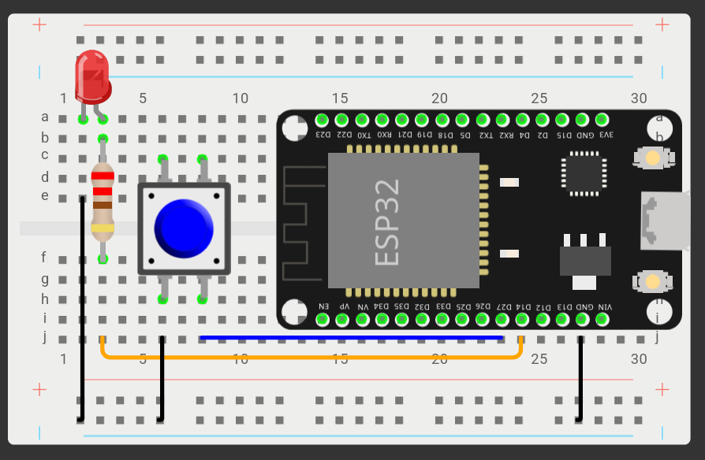
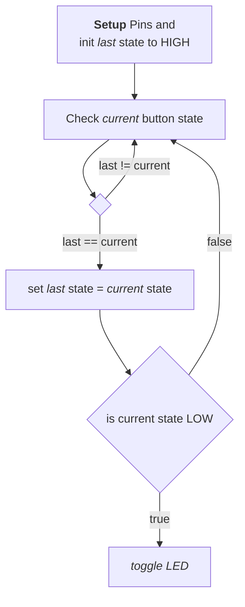

# Buttons

Dieses Lab zeigt Ihnen wie sie einen Taster als User Input nutzen können.

*Vorkenntnisse:*

- [x] [Pin als Eingang nutzen.](./gpio-pins.md)
- [x] [LED ansteuern](./led.md)

*Ziel:*

- [ ] Button mit MCU verbinden (Pullup/Pulldown).
- [ ] Zustand eines Tasters einlesen


## Taster (Push Button)

Ein Taster, nicht zu verwechseln mit einem Schalter ist ein mechanisches Bauteil, welches als Eingang für einen Microcontroller genutzt werden kann.

## Aufbau



## Zustand einlesen

```py
from machine import Pin
btn = Pin(27, Pin.IN, Pin.PULL_UP)

while True:
    current_btn_state = btn.value()
    print(current_btn_state)
```

Der Ausdruck `Pin.PULL_UP` aktiviert den internen Pullup-Widerstand des ESP32.

Dadurch liegt ein HIGH-Pegel am Pin an, wenn der Taster nicht gedrückt ist und ein LOW-Pegel wenn der Taster gedrückt wird.

~~~admonish warning
Ein Taster sollte immer mit einem Pullup oder Pulldown Widerstand verwendet werden, da der Spannungszustand des Taster-Pins sonst nicht stabil ist und der Zustand des Eingangspings sich zufällig ändern kann.
~~~

~~~admonish task
Schreiben Sie ein Programm welches eine LED einschaltet solange der Taster gedrückt ist.
Und die LED wieder ausschaltet falls der Taster nicht mehr gedrückt ist.
~~~

~~~admonish solution
```py
from machine import Pin
led = Pin(14, Pin.OUT)
btn = Pin(27, Pin.IN, Pin.PULL_UP)

while True:
    if 0 == btn.value():
        led.on()
    else:
        led.off()
```

⭐ [Wokwi](https://wokwi.com/projects/420153711218546689)
~~~

## Tastendruck erkennen

Nun wollen wir nicht immer den Taster gedrückt halten nur damit unsere LED leuchtet.
Wir brauchen also eine Möglichkeit zu erkennen ob der Taster gedrückt wurde.



~~~admonish task
Betrachten Sie folgendes Diagram[^flowchart] welches den Ablauf darstellt.
Versuchen Sie dies in Code umzusetzen.
~~~

~~~admonish solution
```py
{{#include ./code/btn_push.py}}
```
~~~


## Kontrollfragen

1. Was passiert, wenn ein Taster direkt (also ohne Pullup-Widerstand) mit dem Microkontroller verbunden wird.

1. Ein Taster ist mit einem Pullup-Widerstand verbunden. Welches Level (HIGH oder LOW) liegt am Pin an, wenn der Taster offen bzw. geschlossen ist? Erläutern Sie Ihre Antwort.

1. Ein Taster ist mit einen Pull-Down-Widerstand angeschlossen. Begründen Sie, welchen Zustand (Spannung) der angeschlossene Pin aufweist, wenn der Taster a) geschlossen und b) geöffnet ist.


[^flowchart]:  Diese Art von Diagram wird auch als Ablaufdiagramm oder Flowchart Diagramm bezeichnet.
