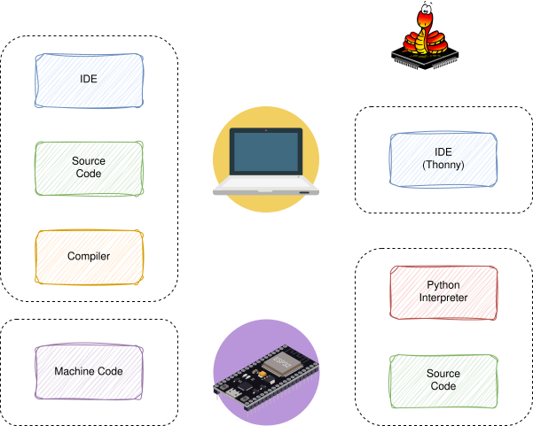

# Einrichtung und Installation von Micropython

*Vorkenntnisse:*

- [x] [Thonny installiert](../00-prepare/software.md)
- [x] [ESP32 Board mit dem PC verbunden](../00-prepare/hardware.md)

*Ziel:*

- [ ] Flashen der Micropython Firmware auf den ESP32.
- [ ] Benutzen der Micropython *REPL*.

## Micropython vs klassische Microcontroller Programmierung



Programmiert man Microcontroller in C/C++ wird die Firmware wie auf der linken Seite dargestellt auf dem PC geschrieben und mit dem Compiler in Machine Code übersetzt. Diese wird dann in den Flash Speicher des Microcontrollers übertragen (Flashen).

Mit Micropython wird zuerst die Micropython Firmware auf den Microcontroller übertragen. Anschließend läuft auf dem Microcontroller ein Python Interpreter welche die Source Dateien, welche auch auf dem Microcontroller gespeichert werden bei der Ausführung interpretieren kann.

Bevor wir loslegen können, müssen wir also erst die Micropython Firmware auf dem ESP32 installieren.

## Installation

### Mit Thonny

<iframe width="750" height="420" src="https://www.youtube.com/embed/BzAo48cFhS8?si=L8PGrxtAfikO7juA" title="YouTube video player" frameborder="0" allow="accelerometer; autoplay; clipboard-write; encrypted-media; gyroscope; picture-in-picture; web-share" referrerpolicy="strict-origin-when-cross-origin" allowfullscreen></iframe>

### Mit dem `esptool`

~~~admonish info
Dies ist eine **ALTERNATIVE** zur Installation mit Thonny falls diese nicht funktioniert oder sie nicht mit Thonny arbeiten wollen.
~~~

Download der Firmware: [Micropython for ESP32](https://micropython.org/download/ESP32_GENERIC/)

~~~admonish warning
Haben Sie eine andere Version des ESP23, als [hier](../00-prepare/hardware.md) angegeben, benötigen sie auch eine andere Firmware!
~~~

ESP Tool installieren
```sh
pip install esptool
```

Verbinden Sie den ESP32 mit dem PC und überprüfen Sie an welchem seriellen Anschluss dieser erreichbar ist.
- Windows: z.B `COM3`
- Unix z.B. `/dev/ttyUSB0` oder `/dev/ttyACM0`

Flash speicher leeren.
```sh
esptool.py -p <serial_port> erase_flash
```

Firmware flashen
```sh
python -m esptool --chip esp32 --port <serial_port> write_flash -z 0x1000 <esp32-X.bin>
```

~~~admonish tip
Sie müssen die folgenden Werte entsprechend ihrer Vorgaben ersetzen.
- *<serial_port>* ist der Serielle Anschluss über welchen der ESP verbunden ist.
- *<esp32-X.bin>* ist die Firmware welche Sie heruntergeladen haben.
~~~
