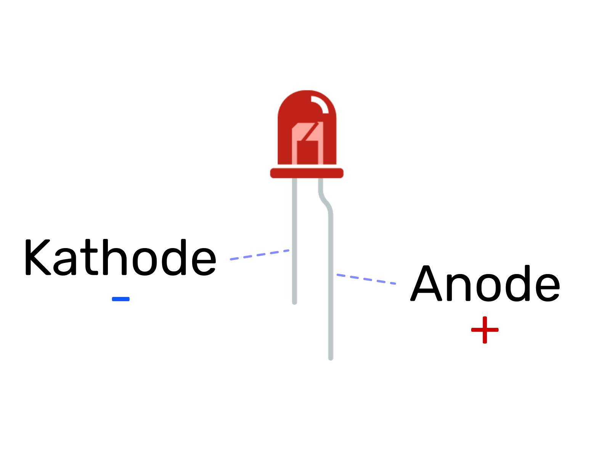
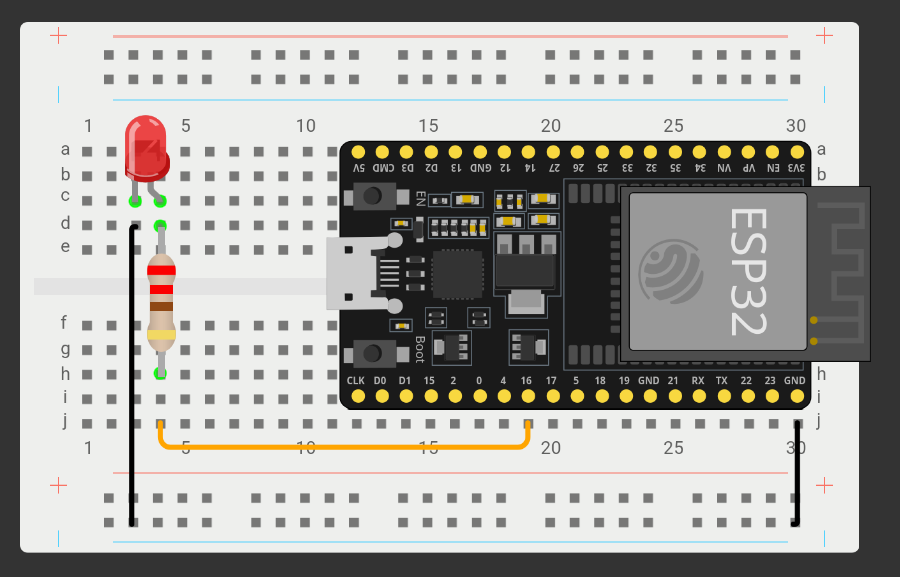

# Blink a LED

Dieses Lab zeigt Ihnen wie sie eine LED mit dem Microcontroller blinken lassen können.

*Vorkenntnisse:*

- [x] [Pin als Ausgang nutzen.](./gpio-pins.md)

*Ziel:*

- [ ] LED mit MCU verbinden.
- [ ] Blockierendes Blinken einer LED
- [ ] Nicht blockierendes Blinken einer LED


## Die LED



weitere Informationen zur LED finden Sie [hier](https://www.elektronik-kompendium.de/sites/bau/0201111.htm).

## Aufbau

~~~admonish task
Bauen Sie folgende Schaltung auf. R=220Ω
~~~



## LED an und aus schalten.

Um die LED mit Micropython anzusteuern müssen Sie den Pin, welcher mit der LED verbunden ist als Ausgang definieren.
Dies haben Sie bereits im [Lab GPIO Pins](./gpio-pins.md) gelernt.

*Beispiel:*
```python
!from machine import Pin
!# LED als Ausgang festlegen.
led_pin = Pin(16, Pin.OUT)
!# LED anschalten
led_pin.on()
```

## Time to blink

~~~admonish task
Schreiben Sie ein Programm welches die LED mit Hilfe der Sleep Funktion im Takt von 500ms blinken lässt. Das heißt die LED ist 500ms an und danach 500ms aus.
~~~

~~~admonish solution
*Variante 1:*
```python
import time
from machine import Pin

led_pin = Pin(16, Pin.OUT)

while True:
  led_pin.on()
  time.sleep(0.5)
  led_pin.off()
  time.sleep(0.5)
```

*Variante 2:*
```python
import time
from machine import Pin

led_pin = Pin(16, Pin.OUT)

while True:
  led_pin.value(not led_pin.value())
  time.sleep(0.5)
```
~~~

Wir wollen nun mehrere LEDs in unterschiedlicher Geschwindigkeit blinken lassen, dazu wollen wir die Funktionalität zunächst in eine eigene Funktion namens `blink` kapseln.
Das könnte zum Beispiel so aussehen.

```python
import time
from machine import Pin

def blink(led, delay_time):
  led.value(not led.value())
  time.sleep(delay_time)

led_pin = Pin(16, Pin.OUT)

while True:
  blink(led_pin, 0.5)
```

~~~admonish task
Fügen Sie eine weitere LED hinzu die im Takt von 700ms blinken soll. -> `blink(led2, 0.7)`

Welche Beobachtung können Sie machen?
~~~


~~~admonish solution
```python
import time
from machine import Pin

def blink(led, delay_time):
  led.value(not led.value())
  time.sleep(delay_time)

led_pin = Pin(16, Pin.OUT)
led2_pin = Pin(17, Pin.OUT)

while True:
  blink(led_pin, 0.5)
  blink(led2_pin, 0.7)
```
~~~

~~~admonish warning collapsible=true title="Beobachtung"
Wie sie vlt festgestellt haben blinken die beiden LEDs hintereinander anstatt parallel, dies liegt daran dass die Funktion `sleep` die MCU daran hindert in dieser Zeit weiter zu arbeiten. Man spricht hier auch von einer **blockierenden** Funktion.
~~~

## Nicht blockierendes Blinken einer LED


Probieren Sie anstatt dessen folgendes Programm

```python
{{#include code/led_blink_nb.py}}
```

~~~admonish task title="Task (Abgabe)"
Beschreiben Sie in eigenen Worten wie das Programm funktioniert und warum dies nicht blockierend ist.
~~~

*Hinweis:* eine weitere Möglichkeit für eine nicht blockierende Lösung sehen Sie im Lab [Timers](timers.md).


## Kontrollfragen

1. Welcher Pol der LED muss an GND angeschlossen werden?
1. Warum benötigen Sie einen Vorwiderstand für die LED?
1. Wie groß sollten Sie den Vorwiderstand mindestens wählen?
1. Wie können Sie eine LED mit Micropython anschalten?
1. Wie können Sie eine LED mit Micropython blinken lassen?
1. Welches Problem kann sich durch die Verwendung von `sleep` zum blinken ergeben?
1. Was versteht man unter dem Begriff **blockierende Funktion**?
1. Welchen Wert gibt die Funktion `time.tick_ms()` zurück.
1. Mit welcher Funktion können Sie berechnen wie viel Zeit seit einem gemessenen Zeitpunkt vergangen ist?


## Übungsaufgaben

1. Lassen Sie die LED abwechselnd 3x blinken und anschließend für 3s leuchten.
1. Erstellen Sie eine Klasse LED, mit den Methoden `on`, `off` und `blink`.
