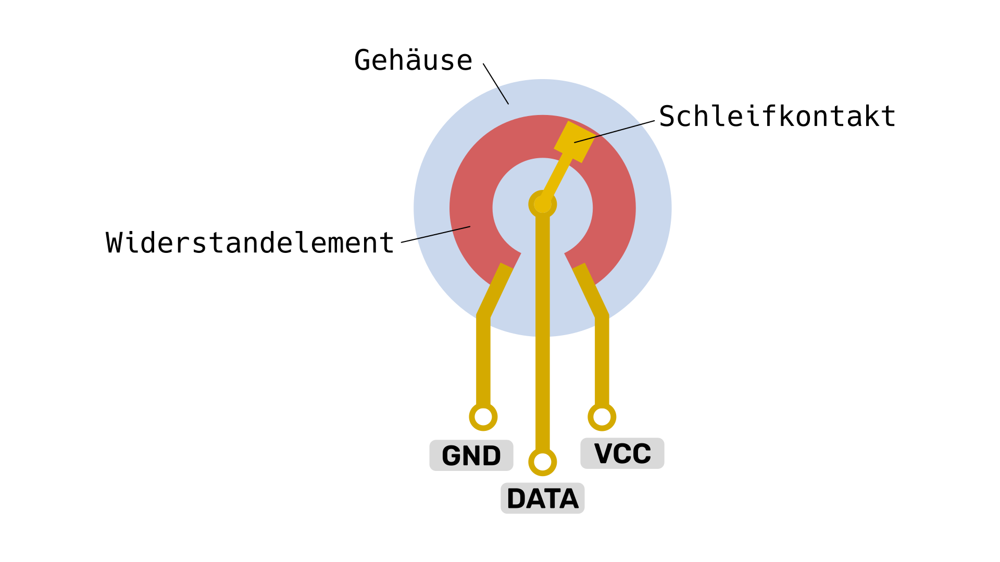
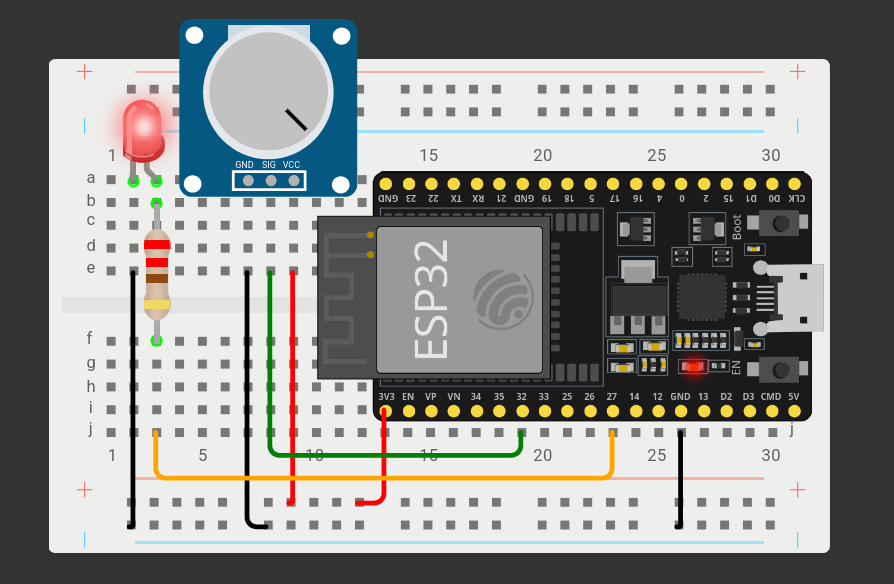

# Poti

Dieses Lab zeigt Ihnen wie sie die wechselnde Spannung von einem Potentiometer als User Input nutzen können.

*Vorkenntnisse:*

- [x] [LED ansteuern](./led.md)

*Ziel:*

- [ ] Poti verbinden
- [ ] ADC nutzen um Spannung zu messen.
- [ ] Wertebereich umrechnen.

## Das Potentiometer

[^Q1]

Ein Potentiometer wirkt wie ein verstellbarer **Spannungsteiler**, der die Spannung zwischen *GND* und *VCC* in Abhängigkeit von der Position des Schleifkontakts teilt.
Durch Drehen des Potentiometers kann die Ausgangsspannung stufenlos verändert und an verschiedene Anforderungen angepasst werden

## Aufbau



~~~admonish task
Bauen Sie die abgebildete Schaltung auf. ([Wokwi](https://wokwi.com/projects/420155497794216961))
~~~

## Analog Digital Wandler

Zuerst müssen wir die Klasse `ADC` aus dem Modul `machine` importieren.
```py
from machine import ADC
```

Der Konstruktor benötigt nur die Pin nummer.
```py
!from machine import ADC
adc = ADC(32)
```

~~~admonish warning
Nicht jeder beliebige Pin kann als ADC verwendet werden. Welche Pins als ADC genutzt werden können steht im [Pinout](./gpio-pins.md) oder im Datenblatt des entprechenden Microcontrollers.

ADC-Block 2 wird auch von WiFi verwendet. Der Versuch, Analogwerte von den Pins des Blocks 2 zu lesen, wenn WiFi aktiv ist, führt daher zu einer Exception.
~~~

Der ADC bietet uns zwei verschieden Methoden um den aktuellen Wert am Pin zu lesen.
```py
!from machine import ADC
!adc = ADC(32)
value = adc.read_u16() # Wert zwischen 0 und 2^16
microvolts = adc.read_uv()  # Wert in microvolts
```

~~~admonish warning
Die interne ADC-Referenzspannung beträgt typischerweise 1,1 V und hat eine minimale Messspannung um 100mV, Spannungen <= diesem Wert werden als 0 gelesen.
~~~

~~~admonish task
Schreiben Sie ein Program welches den Wert vom Poti einliest und jede Sekunde den aktuellen Wert über die serielle Schnittstelle wieder ausgibt.
~~~

~~~admonish solution
```py
{{#include code/poti_echo.py}}
```
~~~

~~~admonish task
Schreiben Sie ein Program welches es ermöglicht eine LED über den Poti ein und aus zu schalten. Die Grenze soll genau in der Mitte des Wertebereichs liegen.
~~~

~~~admonish solution
```py
{{#include code/poti_led.py}}
```
~~~

### Messbereich auf Steuerungsbereich mappen

Ein häufiges Problem im Zusammenhang mit dem Einlesen analoger Werte ist das Umrechnen dieser Werte in einen anderen Wertebereich. Als Beispiel soll mit einem Potentiometer eine LED gedimmt werden. Wir haben nun gesehen, dass wir Werte zwischen 0 und 2^16 einlesen können. Zum Dimmen der LED benötigen wir nun einen Wertebereich zwischen 0 und 255.

Der gewünschte Wertebereich hat also 256 Schritte. Wir müssen nun also den ursprünglichen Bereich in 256 Schritte unterteilen.


| Ursprungsbereich | Zielbereich |
| --- | --- |
0 - 255 | 0 |
256 - 512 | 1 |
513 - 768 |  2 |
... | ... |
65024 - 65279 | 254 |
65280 - 65535 | 255 |

Foglende Formel kann für die Umrechnung genutzt werden:  $$ \text{new\_value} = \frac{\text{value} - min_{in}}{max_{in} - min_{in}} \cdot (max_{out} - min_{out}) + min_{out} $$ Dabei ist $in$ der Ursprungsbereich und $out$ der Zielwertebereich.

~~~admonish info collapsible=true title="Schritt für Schritt Erklärung"
1. Normalisierung auf den Bereich $[0,1]$
$$\frac{\text{value} - min_{in}}{max_{in} - min_{in}}$$
Hier wird der Eingabewert relativ zu seinem Ursprungsbereich skaliert.
2. Skalierung auf den Zielbereich:
$$\cdot (max_{out} - min_{out})$$
Das Ergebnis der Normalisierung wird mit der Größe des Zielbereichs multipliziert.
3. Verschiebung in den Zielbereich:
$$+ min_{out}$$
Schließlich wird das Ergebnis an den Startpunkt (min_out) des Zielbereichs angepasst.
~~~

~~~admonish example collapsible=true title="Beispiel"
Sie wollen den Wert 30 aus dem Wertebereich $[0,100]$ in den Zielbereich $[15,30]$ umrechnen.
1. Normalisierung auf den Bereich $[0,1]$
$$\frac{30 - 0}{100 - 0} = \frac{30}{100} = 0.3$$

2. Skalierung auf den Zielbereich:
$$ 0.3 \cdot (30 - 15) = 0.3 \cdot 15 = 4.5 $$
_Hinweis: Beginnt der Zielbereich bei $0$ wären wir schon fertig._

3. Verschiebung in den Zielbereich:
$$ 4.5 + 15 = 19.5 $$

Das Ergebnis ist $19.5$ ✅
~~~

~~~admonish task
👉 Schreiben Sie eine Funktion `map(value, min_in, max_in, min_out, max_out)` welche diese in Code umsetzt.

_Hinweis: Achten Sie darauf, dass sie nicht durch NULL teilen dürfen._
~~~

~~~admonish tip collapsible=true
Testen Sie ihre Funktion z.B mit folgenden Werten:

| Value | Expected Output |
| --- | --- |
| 65279 | 254,99609375 |
| 65280 | 255 |
~~~

~~~admonish solution
```py
def map(value, min_in, max_in, min_out, max_out):
    if min_in == max_in:
        raise ValueError("Der Eingabebereich darf nicht null sein.")
    return (value - min_in)/(max_in - min_in) * (max_out - min_out) + min_out
```

Diese Funktion gibt einen `float` zurück. Oft brauchen wir jedoch nur den ganzzahligen Anteil (`int`) zum weiterrechnen. Dies können Sie zum Beispiel durch eine Typumwandlung `int(output)` oder eine Integer Division `output//1` erreichen.
~~~


## Übungsaufgaben

1. Schreiben Sie ein Program, dass den Poti nutzt um 3 Zustände (AUS, AN, BLINKEN) einer LED auszuwählen.

1. Schreiben Sie ein Program, dass die Blinkfrequenz einer LED über einen Poti einstellbar macht.

1. Bauen Sie einen Spannungsteiler aus 220 Ω und 1kΩ auf. **Berechnen** Sie den Wert welcher vom ADC eingelesen wird und überprüfen Sie dies mit einem kleinen Program nach. Analysieren Sie mögliche Abweichungen des Messwertes von dem theoretischen Ergebnis.

1. Der Ladestand eines Akkus soll über 5 LEDs optisch dargestellt werden. Nutzen Sie einen Poti um die Spannung des Akkus zu simulieren. Programmieren Sie Ihre Schaltung so, dass proportional zur Stellung des Potentiometers die Anzahl der leuchtenden LEDs variiert. Nutzen Sie die eine `for`-Schleife.

1. Begründen Sie warum Sie einen 9V Akku nicht einfach an den ADC Pin anschließen dürfen. Skizzieren Sie anschließend eine mögliche Lösung um den Akkustand trotzdem zu messen.

1. Werte, die über einen analogen Eingang eingelesen wurden, sollen auf dem seriellen Monitor mit einer Art Balkenanzeige dargestellt werden. Je größer der eingelesen Wert, desto mehr > werden dargestellt. Die Balkenanzeige soll 25 Balken haben und das Maximum wird durch | angezeigt. Mit einem angeschlossenen Potentiometer soll die Balkenanzeige gesteuert werden.[^Q2]


## Resources

- [Offizielle Documentation zu `machine.ADC`](https://docs.micropython.org/en/latest/library/machine.ADC.html)
- [Micropython ESP32 Quickref](https://docs.micropython.org/en/latest/esp32/quickref.html#adc-analog-to-digital-conversion)

[^Q1]: Quelle: <https://sensorkit.arduino.cc/sensorkit/module/lessons/lesson/03-the-potentiometer>
[^Q2]: Quelle: <https://spacehal.github.io/docs/arduino/analogInput>
