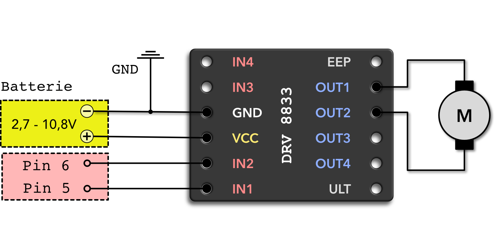

# Motor Driver ICs

# Controlling a motor

*Vorkenntnisse*

- [x] [Controlling a motor](./intro.md)

*Ziel:*

- [ ] Motorsteuerungen nutzen

Neben den beiden zuvor vorgestellten Lösungen gibt es auf dem Markt auch eine Reihe von fertigen ICs für die Motoransteuerung.
Bekannte Motortreiber sind z.B der `L298N`, `DRV8833`, `TB6612FNG`,  ...

## `LN298` vs `DRV8833`

**Strom und Spannung:**

- `L298N`: Bis 46V, max 2A pro Kanal (ohne Kühlung eher 1A)
- `DRV8833`: 2.7V - 10.8V, max 1.5A pro Kanal (kurzfristig: 2A)

**Wirkungsgrad:**

- `LN298`: Bipolartransistoren (hohe Wärmeentwicklung, Spannungsverlust ~2V)
- `DRV8833`: MOSFET-Technologie (weniger Hitzeentwicklung, niedriger Spannungsabfall)

Fazit: Der DRV8833 ist erheblich effizienter und bleibt kühler.

**Preis:**

- `L298N`: Tendenziell günstiger, aber mit dem Nachteil der geringeren Effizienz
- `DRV8833`: Etwas teurer, aber modernes Design und bessere Leistung

~~~admonish task
Entscheiden und Begründen Sie welcher Treiber besser für ihr Projekt geeignet ist.
~~~

~~~admonish solution
- `L298N`: Wenn du höhere Spannungen (z. B. 24 V) brauchst und Effizienz nicht so wichtig ist.
- `DRV8833`: Für batteriebetriebene Anwendungen, kleine Motoren (bis 10 V) besser geeignet.
~~~

## DRV8833 nutzen

Im folgenden wollen wir uns anschauen, wie wir den Treiber verwenden können.
Dazu schauen wir uns zunächst die Verdrahtung an.

~~~admonish info
Die Pins 5 und 6 können auch durch andere Pins am ESP32 ersetzt werden.[^1]
~~~

[^1]: Bildquelle: [rule the bot](https://spacehal.github.io/docs/motor/drv8833)