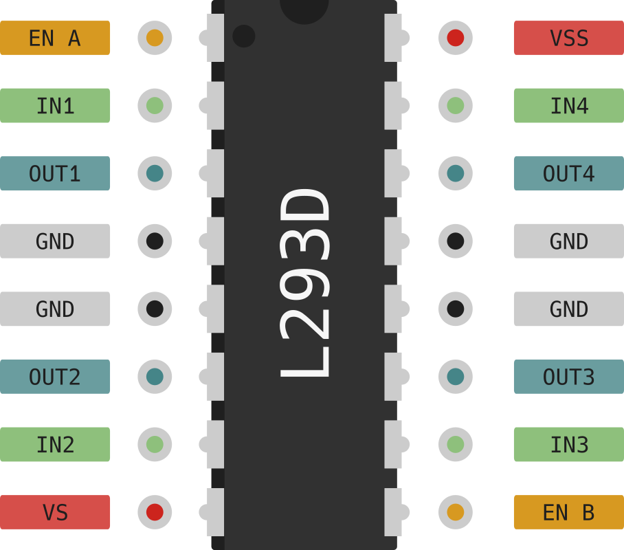
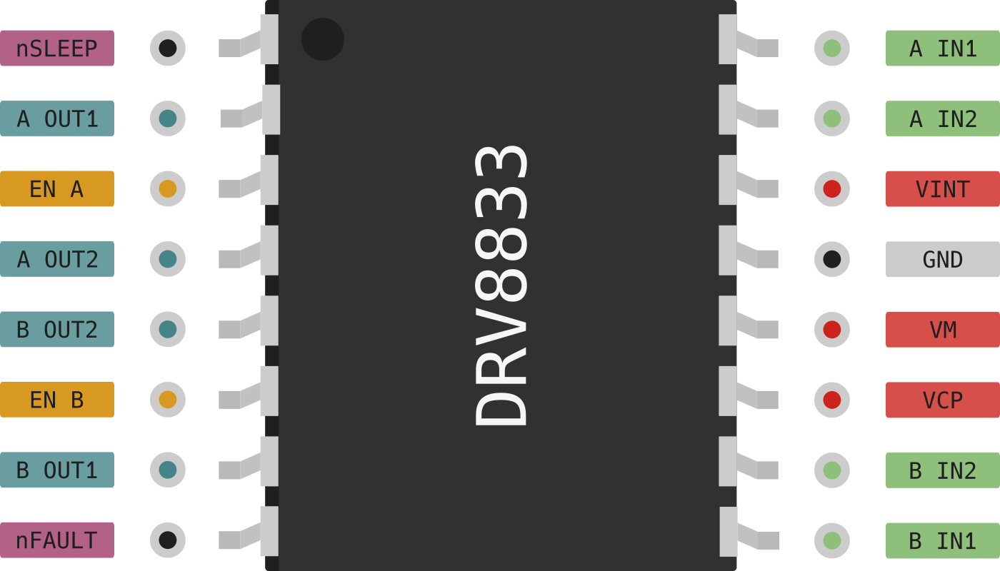

# Motor Driver ICs

# Controlling a motor

*Vorkenntnisse*

- [x] [Controlling a motor](./intro.md)

*Ziel:*

- [ ] Motorsteuerungen nutzen

Neben den beiden zuvor vorgestellten Lösungen gibt es auf dem Markt auch eine Reihe von fertigen ICs für die Motoransteuerung.
Bekannte Motortreiber sind z.B der `L298N`, `L293D`,  `DRV8833`, `TB6612FNG`,  ...

## `LN293D` vs `DRV8833`

**Strom und Spannung:**

- `L293D`: Bis 36V, max 600mA  pro Kanal (kurzfristig: 1.2 A)
- `DRV8833`: 2.7V - 10.8V, max 1.5A pro Kanal (kurzfristig: 2A)

**Wirkungsgrad:**

- `LN293D`: Bipolartransistoren (hohe Wärmeentwicklung, Spannungsverlust ~1.5V)
- `DRV8833`: MOSFET-Technologie (weniger Hitzeentwicklung, niedriger Spannungsabfall)

Fazit: Der DRV8833 ist erheblich effizienter und bleibt kühler.

**Preis:**

- `L293D`: Tendenziell günstiger, aber mit dem Nachteil der geringeren Effizienz
- `DRV8833`: Etwas teurer, aber modernes Design und bessere Leistung

~~~admonish task
Entscheiden und Begründen Sie welcher Treiber besser für ihr Projekt geeignet ist.
~~~

~~~admonish solution
- `L293D`: Wenn du höhere Spannungen (z. B. 24 V) brauchst und Effizienz nicht so wichtig ist.
- `DRV8833`: Für batteriebetriebene Anwendungen, kleine Motoren (bis 10 V) besser geeignet.
~~~

## L293D nutzen

Der L293D ist ein Dual H-Brücke Motortreiber, der zwei Motoren in beide Richtungen steuern kann.
Das Pinout liefert uns die nötigen Informationen zu den Anschlüssen des ICs.

**Power Pins:**

- `VSS`: Versorgungsspannung für die Logik (5V)
- `VS`: Versorgungsspannung für die Motoren (4.5V - 36V)

**Richtung festlegen:**

Die Richtung des Motors wird durch die Pins `IN1` und `IN2` festgelegt.

| `IN1` | `IN2` | Motor |
|-------|-------|-------|
| LOW | LOW  | Stop  |
| HIGH | LOW  | Vorwärts |
| LOW | HIGH | Rückwärts |
| HIGH | HIGH | Stop  |

**Geschwindigkeit festlegen:**

Über den Pin `EN A` kann die Geschwindigkeit des Motors eingestellt werden.

- Ist der Pin `EN A` LOW, stoppt der Motor.
- Ist der Pin `EN A` HIGH, läuft der Motor mit voller Geschwindigkeit.
- Für eine Variable Geschwindigkeit kann der Pin `EN A` auch mit einem PWM-Signal angesteuert werden.

~~~admonish note title="Alternative" collapsible=true
Sie können auch den `EN1` Pin dauerhaft auf HIGH setzen und die Geschwindigkeit über die Pins `IN1` und `IN2` steuern.
~~~

**Ausgangssignale:**

An den beiden Ausgangssignalen `OUT1` und `OUT2` liegt die Spannung an, die den Motor antreibt.

~~~admonish info
Den zweiten Motor steuern Sie equivalent mit `IN3`, `IN4` und `EN B`.
~~~

## DRV8833 nutzen

Dieser Motortreiber hat ebenfalls zwei H-Brücken integriert. Dies erkennt man auch wieder am Pinout.

Neben dem reinen Chip, welcher nicht als Breadboard kompatibles Design verfügbar ist, gibt es auch Module, auf denen der Chip bereits verbaut ist.
Der Anschluss solcher Module ist dann relativ einfach.

~~~admonish info
Die Pins 5 und 6 können auch durch andere Pins am ESP32 ersetzt werden.[^1]
~~~

Wie sie sehen gibt es hier keinen enable Pin. Sie steuern die Richtung und Geschwindigkeit des Motors über die Pins `IN1`, `IN2` indem Sie ein `PWM` Signal verwenden.

[^1]: Bildquelle: [rule the bot](https://spacehal.github.io/docs/motor/drv8833)
