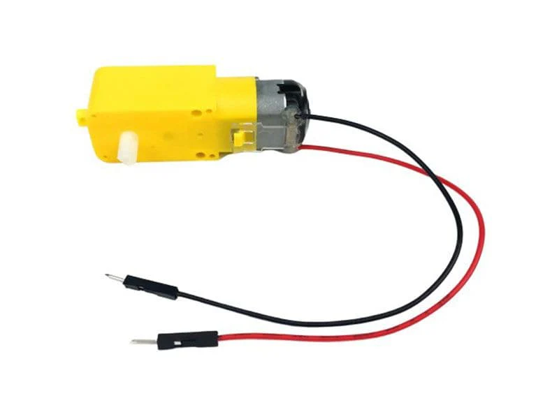

# Controlling a motor

*Vorkenntnisse*

- [x] [GPIO Pin als Ausgang nutzen](../01-basics/gpio-pins.md)
- [x] [PWM Signal erzeugen](../01-basics/pwm.md)

Um einen Motor anzusteuern könnten Sie auf die Idee kommen diesen, wie eine LED direkt an einen GPIO-Pin anzuschließen.
Dies ist jedoch eine sehr schlechte Idee. Hier wollen wir uns anschauen warum und welche Lösung es dafür gibt.

## Leistungsaufnahme eines Motors.

Sie können diese Motoren mit 3V bis 6V betreiben, wobei sie bei höheren Spannungen natürlich etwas schneller laufen.
Wenn Sie ins Datenblatt schauen oder selbst Messungen durchführen können folgende Werte ermittelt werden:

- Bei 3 V  wurden 150 mA bei 120 U/min im Leerlauf und 1,1 A im Stillstand (_Motor blockiert_) gemessen.
- Bei 4,5 V wurden 155 mA bei 185 Umdrehungen pro Minute ohne Last und 1,2 Ampere im Stillstand gemessen.
- Bei 6 V wurden 160 mA bei 250 Umdrehungen pro Minute ohne Last und 1,5 Ampere im Stillstand gemessen.

### Probleme

Wenn Sie die Werte genauer ansehen, ist Ihnen eventuell aufgefallen, dass unser ESP32 nicht mit 6V sondern nur 3.3V arbeitet.
Wir könnten den Motor also garnicht mit voller Geschwindigkeit laufen lassen.

Das zweite, und viel größere **Problem** ist jedoch, dass ein GPIO-Pin des Microcontrollers **max 40mA** liefern kann.

~~~admonish warning
Zieht unser Motor einen Strom von 150mA kann das dazu führen, dass der GPIO-Pin *dauerhaft Beschädigt* wird.
~~~

### Lösung

Je nach Anwendungsfall gibt es verschiedene Lösungsmöglichkeiten für dieses Problem.

- Nutzen eines Transistors zur Ansteuerung
- Nutzen einer H-Brücke zur Ansteuerung
- Nutzen eines Motor-Treiber-ICs
