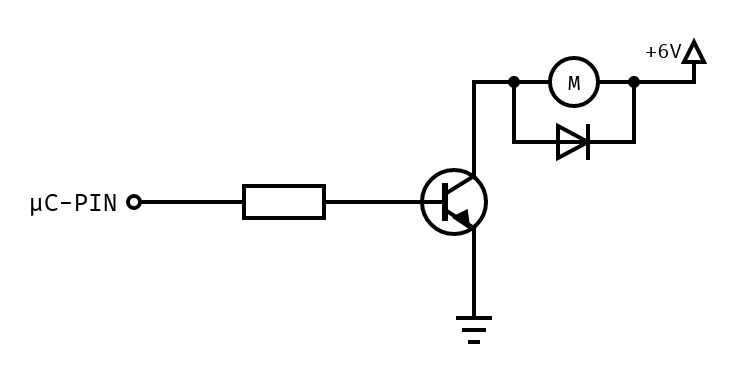

# Transistorschaltung

Die meisten Microcontroller können maximal 20 - 40mA bei 3.3V/5V pro Ausgangspin liefern. Dies reicht für DC-Motoren in der Regel nicht aus.
Man benötigt mindestens eine einfache Transitorschaltung um den Motor anzusteuern.
Transistoren sind kleine elektronische Halbleiter-Bauteile, um Schaltkreise zu steuern und Signale zu verstärken.

Transitoren gibt es in verschiedenen Typen (FET und BJT). Welcher Transitor am besten für einen konkreten Anwendungsfall geeignet ist, ist nicht Teil dieses Tutorials.  Für die hier gezeigte Beispielschaltung wird ein NPN-Bipolartransitor verwendet.

Hier finden Sie ein kurzes [Erklärvideo](https://studyflix.de/elektrotechnik/transistor-2536) als Übersicht zum Transitor.

## Schaltplan

## Ansteuerung

Sie können den Motor nun über den Ausgangspin steuern.

- `LOW` schaltet den Motor aus.
- `HIGH` schalten den Motor ein (Fullspeed).
- Mit einem `PWM` Signal kann die Geschwindigkeit gesteuert werden.

~~~admonish task title="Aufgabe (Optional)"
Wenn Sie genug Zeit haben bauen Sie die Schaltung auf und programmieren eine einfache Steuerung.
~~~

## Kontrollfragen

- Für welche Anwendungsfälle ist diese Schaltung geeignet?
