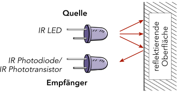

# IR

*Vorkenntnisse*

- [x] [Grundverständnis über python classes](https://www.programiz.com/python-programming/class)

*Ziel:*

- [ ] Funktionsweise eines IR Sensors kennenlernen.
- [ ] Verwendung des Sharp IR-Sensor Moduls.


## Funktionsweise

Infrarotsensoren (IR-Sensoren) arbeiten nach dem Prinzip der Lichtreflexion. Eine eingebaute Infrarot-LED sendet Licht aus, das von einer Oberfläche reflektiert wird. Ein Fotodetektor misst anschließend die Intensität des zurückgeworfenen Lichts.

[^1]

### Einflussfaktoren auf das Messsignal

Die Stärke des reflektierten Lichts hängt von mehreren Faktoren ab:

- Abstand zwischen Sensor und Objekt
- Oberflächenbeschaffenheit (rau, glatt, glänzend, matt)
- Farbe der Oberfläche (helle Flächen reflektieren mehr Licht)
- Ausrichtung der Oberfläche zur Lichtquelle

Deshalb eignen sich einfache IR-Sensoren gut zur Objekt- oder Linienerkennung.
Für sehr präzise Abstandsmessungen sind sie nur bedingt geeignet, für eine grobe Entfernungsabschätzung jedoch ausreichend gut.

### Störquellen aus der Umgebung

In realen Umgebungen gibt es viele zusätzliche Lichtquellen – z. B. Sonnenlicht oder Lampen. Diese senden ebenfalls Licht aus, das vom IR-Sensor erfasst werden kann. Solche Störungen können zu ungenauen Messergebnissen führen. Dies sollte beim Testen der Sensoren bedacht werden.

### Warum Infrarotlicht verwendet wird

Um den Einfluss von Umgebungslicht zu verringern, nutzen IR-Sensoren meist Infrarotlicht mit einer bestimmten Wellenlänge.
Dieses Licht liegt mit etwa 950 Nanometern außerhalb des für Menschen sichtbaren Spektrums (sichtbares Licht endet bei ca. 780 nm).

Durch den gezielten Einsatz dieser Wellenlänge kann der Sensor das eigene Lichtsignal von anderen Lichtquellen besser unterscheiden – das erhöht die Messsicherheit und Zuverlässigkeit.


[^1]: Bildquelle: [rule the bot](https://spacehal.github.io/docs/sensoren/irSensor)


## Sensorschaltung mit IR-LED und Phototransistor

Mit einer IR-LED und einem Phototransitor kann man eine geeignete Schaltung aufbauen.
Eine Beispielhafte Schaltung ist bei [rule the bot](https://spacehal.github.io/docs/sensoren/irSensor) zu finden.
Diese basiert jedoch auf der Ansteuerung mit einem Arduino Uno.

## Entfernungsmessung mit dem Sharp GP2Y0A51SK0F Modul

Das *GP2Y0A51SK0F* von Sharp ist ein analoger Infrarot-Abstandssensor, der sich ideal zur kurzreichweitigen Entfernungsmessung eignet (2–15cm).
Dabei wird die analoge Spannung des Sensors über einen ADC (Analog-Digital-Wandler) eingelesen und in eine Entfernung umgerechnet. Dank seiner geringen Größe und schnellen Reaktionszeit ist der Sensor besonders gut für Robotik- oder Hindernisvermeidungsanwendungen geeignet.


~~~admonish task
- Nutzen Sie den ADC um die erzeugte Spannung des Moduls einzulesen.
- Recherchieren Sie im [Datenblatt](https://global.sharp/products/device/lineup/data/pdf/datasheet/gp2y0a51sk_e.pdf) wie die eingelesenen Werte in eine Entfernung umgerechnet werden können.
~~~

~~~admonish solution
```py
{{#include ./code/ir.py}}
```

Die Umrechung ist eine vereinfachte Näherung basierend auf typischen Werten aus dem Datenblatt. Für genauere Messungen empfiehlt sich eine individuelle Kalibrierung.

~~~

~~~admonish warning
Der Sensor ist sehr empfindlich gegenüber Umgebungslicht und Oberflächenmaterialien.
~~~
