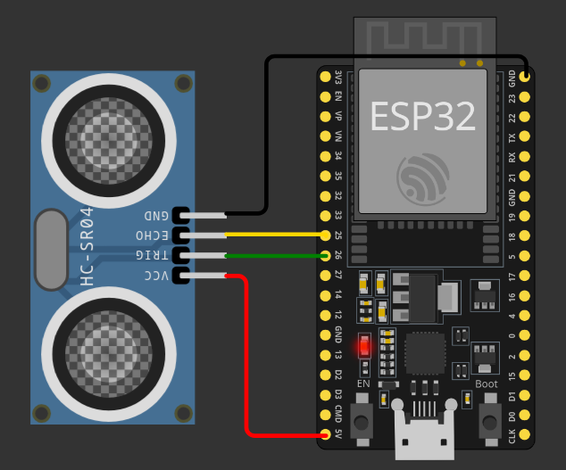

# Ultraschall

*Vorkenntnisse*

- [x] [Grundverständnis über python classes](https://www.programiz.com/python-programming/class)

*Ziel:*

- [ ] Funktionsweise eines Ultraschall Sensors kennenlernen.
- [ ] Vorgefertigte Bibliothek nutzen.
- [ ] HC-SR04 Ultraschall Sensor auslesen.


## Funktionsweise

Der Ultraschallsensor HC-SR04 verwendet Sonar zur Bestimmung der Entfernung zu einem Objekt. 
Der Sensor funktioniert in einem Bereich von 2cm - 4m, mit einer Genauigkeit von 0,3cm.

[^1]

+ Der Ultraschallsender (Triggerstift) sendet einen hochfrequenten Ton (40 kHz) aus.
+ Der Schall wandert durch die Luft. Wenn er auf ein Objekt trifft, wird er zum Modul zurückgeworfen.
+ Der Ultraschallempfänger (Echo-Pin) empfängt den reflektierten Schall (Echo).

Unter Berücksichtigung der Geschwindigkeit des Schalls in der Luft und der Laufzeit (Zeit, die seit der Übertragung und dem Empfang des Signals verstrichen ist) können wir die Entfernung zu einem Objekt berechnen. Hier ist die Formel:

$$ Abstand = ((Schallgeschwindigkeit \ in\ der\ Luft) * gemessene Zeit) / 2 $$

Bei 20° ist die Schallgeschwindigkeit in der Luft **343 $m/s$**

## Verwendung 

Ok wir wissen nun wie der Sensor in der Theorie funktioniert, schauen wir uns nun die Praxis an.

### Aufbau:

Um das Modul zu verwenden müssen wir es zunächst an den ESP32 anschließen. 
Im folgenden sehen Sie eine mögliche Verdrahtung.



~~~admonish info
Sie können den `TRIGGER` und `ECHO` Pin auch an zwei andere Pins (z.B `GPIO 5` und `GPIO 18`) anschließen. 
Dies müssen Sie dementsprechend später im Programm berücksichtigen. 
Hier finden Sie den Aufbau auf [⭐ Wokwi](https://wokwi.com/projects/422798595700006913)
~~~

### Programmcode

Ok, verkabelt ist. Nun müssen wir also ein Signal über den `TRIGGER` Pin senden und am `ECHO` Pin messen wie lange es dauert bis das Signal zurück kommt. Anschließend noch mit der Formel die Zeit in cm umrechnen und schon haben wir unseren Abstand.

Wir könnten uns nun die Mühe machen, das alles selbst zu programmieren, aber zum Glück hat schon jemand anderes sich für uns die Arbeit gemacht. 
Im folgenden finden Sie eine Bibliothek (python Datei) welche wir in unser Projekt einbinden können.

~~~admonish solution title="HC-SR04 Bibliothek (hcrs04.py)"
```python
{{#include code/hcrs04.py}}
```
~~~

~~~admonish info
Sie können sich gerne einmal den Quellcode der Bibliothek anschauen und versuchen nachzuvollziehen. 
Aber das wichtige für uns ist wie man die Bibliothek nutzen kann und nicht sie in allen Einzelheiten zu verstehen.
~~~

#### Bibliothek einbinden

Damit wir die Bibliothek nutzen können müssen wir sie zuerst in unser Projekt einbinden. 
Gehen Sie dazu wie folgt vor.

+ Öffnen Sie Thonny und stecken Sie den ESP32 an.
+ Erstellen Sie eine neue Datei und kopieren Sie den **kompletten** Inhalt der Bibliothek in diese Datei.
+ Speichern Sie diese Datei unter dem Namen `hcrs04.py` auf dem Micropython Device.


Danach sollten Sie die neue Datei auf dem Gerät sehen können. 

#### Bibliothek nutzen

Als nächsten Schritt müssen wir die Bibliothek in unsere `main.py` einbinden.

```python
from hcsr04 import HCSR04
```

Anschließend können wir ein Objekt der Klasse `HCSR04` erzeugen.

```python
sensor = HCSR04(trigger_pin=26, echo_pin=25, echo_timeout_us=20000)
```

Das Objekt speichern wir in der Variablen `sensor`. Der Konstruktor benötigt 3 Argumente. 
Die Pin-Nummer, welche mit dem `TRIGGER` verbunden ist. Die Pin-Nummer, welche mit dem `ECHO` verbunden ist. Sowie eine Zeit nachdem die Messung abgebrochen wird.

Dann können wir in unserer Endlosschleife die Methode `distance_cm()` aufrufen, welche uns die gemessene Distanz in cm zurück liefert.

```python
distance = sensor.distance_cm()
```

Ein Blick in die Bibliothek verrät uns das es auch eine Methode `distance_mm()` gibt, welche die Distanz in mm zurück gibt.

Hier sehen Sie nochmal die komplette `main.py` auf einen Blick.

```python
{{#include code/main.py}}
```

~~~admonish tip
Liefert die Methode `distance_cm` einen negativen Wert zurück, ist die Entfernung zum Hinderniss zu groß und der Timeout hat die Messung abgebrochen.
- Ist der maximale gemessene Abstand kleiner als 4m können Sie den Timeout Wert erhöhen. 
- Benötigen Sie nur die Info ob ein Abstand kleiner oder größer als ein Schwellwert ist, z.B 22cm, können Sie den Timeout-Wert auch verkleinern um die Messzeit zu reduzieren.
~~~


## Übungen

~~~admonish task
1. Probieren Sie verschiedene Messungen indem Sie den Abstand mit ihrer Hand verändern.
2. Überprüfen Sie mit einem Lineal ob die Messungen (abzüglich Messfehler und Genauigkeit) stimmen.
3. Lassen Sie je nach Abstand zum Sensor eine LED leuchten. Bsp: < 8cm LED aus. > 8cm LED an.
4. Erweitern Sie ihren Aufbau mit einem zweiten Abstandssensor und lassen Sie zwei LEDs bei einem Schwellwert leuchten oder eben nicht.
~~~


[^1]: Bildquelle: [random nerd tutorials](https://randomnerdtutorials.com/micropython-hc-sr04-ultrasonic-esp32-esp8266/)