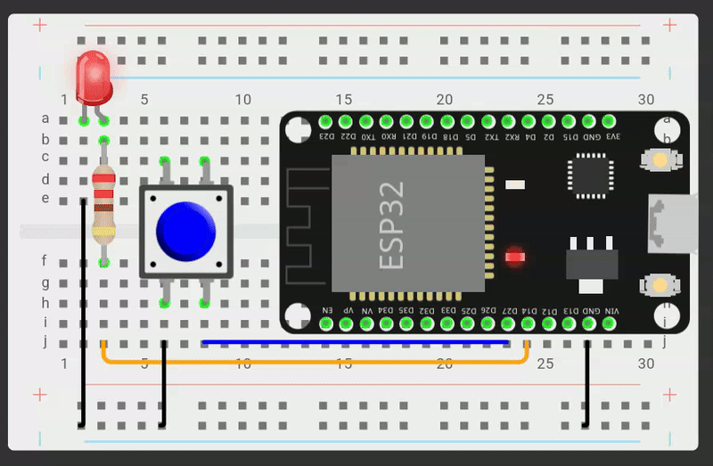
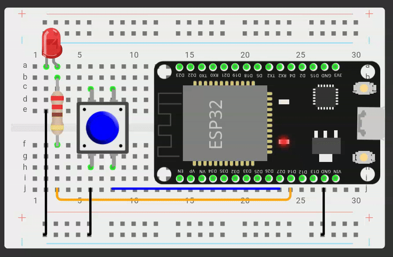

# Taster entprellen
Dieses Lab zeigt Ihnen wie sie einen Taster für eine solidere Eingabe entprellen können.

*Vorkenntnisse:*

- [x] [Taster als Input nutzen](../01-basics/button.md)

*Ziel:*


- [ ] Taster entprellen.

## What is it with bouncing?



Beim testen des vorherigen Beispiels ist ihnen vlt aufgefallen, dass diese Methode nicht immer sicher einen Tastendruck erkannt hat. Um genau zu sein, hat das Programm zu viele Tastendruücke erkannt. Dies liegt an der mechanischen Bauweise solcher Taster.

Das Signal ist nicht wie zu erwarten ein sauberer übergang von HIGH zu LOW, sondern sieht eher so aus.

[^Q1]

Es gibt nun verschiedene Lösungen für dieses Problem:
- eine Hardware Schaltung zum entprellen bauen.
- eine einfache blockierende Entprelllogik in Software.
- eine nicht blockierende Entrelllogik in Software.

Wir wollen uns hier nur die letzten beiden Lösungen anschauen.



Das Ergebnis sollte eine saubere Erkennung des Tasters sein.

### Blocking Debounce

Hier sehen Sie eine Mögliche Lösung:
```py
{{#include ./code/btn_debounce.py}}
```

~~~admonish task title="Task (Abgabe)"
Skizzieren Sie ein Ablaufdiagram für den gegebenen Code.
~~~

### Nonblocking Debounce

Wie beim blinken der LED haben wir nun auch das Problem das die `sleep` funktion die CPU blockiert.
Das Prinzip für einen nicht blockierendes Entprellen des Tasters, ist sehr ähnlich zum nicht blockierenden blinken einer LED.

```py
{{#include ./code/btn_debounce_nb.py}}
```

~~~admonish task
Beschreiben Sie den Algorithmus zum entprellen des Tasters in eigenen Worten.
~~~

## Kontrollfragen

1. todo
1. todo
1. todo

## Weitere Ressourcen

Es gibt noch einige weitere Möglichkeiten und Algorithmen zum Entprellen eines Tasters.
- [Switch bounce and solutions to it](https://www.skillbank.co.uk/arduino/switchbounce.htm)


[^Q1]: Quelle: <https://spacehal.github.io/img/arduino/debounce.png>
